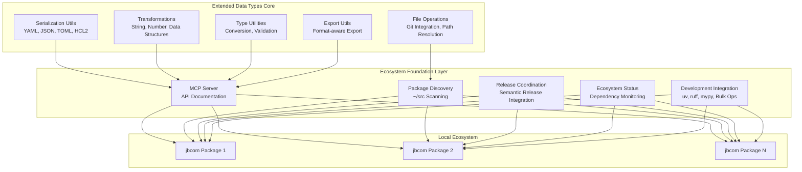

# Design Document

## Overview

This design document outlines the transformation of extended-data-types from a standalone utility library into the foundational ecosystem package for all jbcom Python projects. The design preserves all existing functionality (80+ utility functions, 302 test cases, 85.72% coverage) while adding ecosystem coordination capabilities through MCP integration, package discovery, and release coordination.

The transformation leverages the existing mature architecture:
- **Proven Utility Library**: 80+ functions across serialization, file operations, transformations, and type utilities
- **Robust Testing**: 302 test cases with comprehensive coverage and multi-environment validation
- **Modern CI/CD**: GitHub Actions with semantic-release, tox multi-environment testing, and automated PyPI publishing
- **Type Safety**: Full mypy compliance with strict mode and comprehensive type annotations

## Architecture

### High-Level Architecture



### Component Architecture

The ecosystem foundation builds upon the existing extended-data-types architecture without disrupting the proven utility functions:

1. **Core Utilities Layer** (Preserved): All existing 80+ functions remain unchanged
2. **Ecosystem Coordination Layer** (New): MCP server, package discovery, release coordination, ecosystem status monitoring
3. **Integration Layer** (Enhanced): Improved development workflow integration with bulk operations and cross-package management

## Components and Interfaces

### 1. MCP Server Component

**Purpose**: Provide stdio-based API documentation and usage guidance for all extended-data-types utilities.

**Interface**:
```python
class ExtendedDataTypesMCPServer:
    def __init__(self, api_surface: dict[str, Any]) -> None:
        """Initialize MCP server with complete API surface from __all__ exports."""
        
    def get_function_documentation(self, function_name: str) -> FunctionDoc:
        """Return complete documentation for a utility function."""
        
    def get_category_functions(self, category: str) -> list[FunctionDoc]:
        """Return all functions in a category (serialization, file_ops, etc.)."""
        
    def get_usage_examples(self, function_name: str) -> list[UsageExample]:
        """Return practical usage examples from tests and documentation."""
        
    def search_functions(self, query: str) -> list[FunctionDoc]:
        """Search functions by name, description, or functionality."""
```

**Implementation Details**:
- Loads all functions from `extended_data_types.__all__` exports
- Extracts type signatures using `inspect` module
- Parses docstrings for parameter and return type documentation
- Organizes functions by categories: serialization, file operations, transformations, data structures, type utilities
- Provides usage examples extracted from the 302 test cases
- **Serialization Functions**: Documents encode_yaml, decode_yaml, LiteralScalarString, YamlTagged, encode_json (with orjson options), encode_toml, decode_toml, decode_hcl2
- **File Operations**: Documents read_file, write_file, decode_file (with format auto-detection), get_parent_repository, resolve_local_path, match_file_extensions
- **String Transformations**: Documents to_snake_case, to_camel_case, to_kebab_case, pluralize, humanize, and number formatting utilities
- **Data Structures**: Documents deep_merge, flatten_map, filter_list, SortedDefaultDict, and collection manipulation functions
- **Type Utilities**: Documents convert_special_types, make_hashable, and safe type conversion utilities

### 2. Package Discovery Component

**Purpose**: Discover and track jbcom Python packages in ~/src directory using existing Git utilities.

**Interface**:
```python
class EcosystemPackageDiscovery:
    def __init__(self, base_path: Path = Path.home() / "src") -> None:
        """Initialize package discovery with base scanning path."""
        
    def scan_packages(self) -> list[PackageInfo]:
        """Scan for Python packages using existing get_parent_repository."""
        
    def get_package_dependencies(self, package_path: Path) -> list[Dependency]:
        """Parse pyproject.toml to extract extended-data-types dependencies."""
        
    def check_version_compatibility(self, packages: list[PackageInfo]) -> CompatibilityReport:
        """Validate semantic version constraints across packages."""
        
    def monitor_filesystem_changes(self) -> None:
        """Monitor ~/src for new packages using file system events."""
```

**Implementation Details**:
- Uses existing `get_parent_repository` and `get_tld` functions from file_data_type.py
- Parses pyproject.toml files using existing `decode_toml` function
- Leverages existing Git integration for repository detection
- Integrates with existing GitHub CLI authentication patterns
- **GitHub CLI Integration**: Uses pre-authenticated `gh` commands without requiring additional token configuration
- **Git Operations**: Leverages existing get_parent_repository, get_repository_name, get_tld, clone_repository_to_temp functions
- **Non-Interactive Operations**: Uses `GIT_EDITOR=true` for git commands to avoid external editor spawning
- **Repository Detection**: Uses Git repository detection to identify jbcom packages in ~/src directory

### 3. Release Coordination Component

**Purpose**: Coordinate releases using the existing semantic-release workflow and conventional commits.

**Interface**:
```python
class ReleaseCoordinator:
    def __init__(self, semantic_release_config: dict[str, Any]) -> None:
        """Initialize with existing semantic-release configuration."""
        
    def analyze_version_impact(self, commit_history: list[Commit]) -> VersionImpact:
        """Analyze conventional commits for semantic version impact."""
        
    def generate_migration_guide(self, breaking_changes: list[Change]) -> MigrationGuide:
        """Generate migration guidance for API changes."""
        
    def notify_downstream_packages(self, version_info: VersionInfo) -> None:
        """Notify dependent packages of new releases."""
        
    def validate_release_readiness(self) -> ReleaseValidation:
        """Validate that all tests pass and CI is green."""
```

**Implementation Details**:
- Integrates with existing semantic-release configuration in pyproject.toml
- Uses existing GitHub Actions workflow for CI/CD validation
- Leverages existing conventional commit patterns and changelog generation
- Maintains compatibility with current PyPI publishing process

### 4. Ecosystem Status and Monitoring Component

**Purpose**: Provide comprehensive ecosystem visibility and dependency management across all jbcom packages.

**Interface**:
```python
class EcosystemStatusMonitor:
    def __init__(self, package_discovery: EcosystemPackageDiscovery) -> None:
        """Initialize with package discovery component."""
        
    def generate_dependency_graph(self) -> DependencyGraph:
        """Generate dependency graph showing extended-data-types usage and version constraints."""
        
    def check_for_updates(self) -> UpdateReport:
        """Identify packages with outdated extended-data-types dependencies and suggest upgrade paths."""
        
    def validate_ecosystem_health(self) -> HealthReport:
        """Detect version conflicts, missing dependencies, and incompatible constraints."""
        
    def get_ecosystem_status(self) -> EcosystemStatus:
        """Provide comprehensive status including dependency graphs, version info, and health reports."""
```

**Implementation Details**:
- Builds comprehensive dependency graphs showing package relationships
- Tracks version constraints and identifies outdated dependencies
- Provides upgrade path recommendations based on semantic versioning
- Detects and reports version conflicts and incompatible constraints
- Integrates with bulk operations for ecosystem-wide updates

### 5. Development Integration Component

**Purpose**: Provide seamless integration with existing uv-based development workflow and bulk operations across multiple packages.

**Interface**:
```python
class DevelopmentIntegration:
    def __init__(self, project_template_path: Path) -> None:
        """Initialize with project template configuration."""
        
    def create_project_template(self, project_name: str) -> ProjectTemplate:
        """Create new project with extended-data-types integration."""
        
    def configure_development_environment(self, project_path: Path) -> None:
        """Configure uv, ruff, mypy, pytest to match ecosystem standards."""
        
    def validate_ecosystem_compliance(self, project_path: Path) -> ComplianceReport:
        """Validate project follows ecosystem patterns."""
        
    def update_mcp_configuration(self, project_path: Path) -> None:
        """Update .kiro/settings/mcp.json with extended-data-types server."""
        
    def run_bulk_operations(self, packages: list[PackageInfo], command: str) -> BulkOperationResult:
        """Execute uv sync, pytest, or ruff commands across multiple packages."""
        
    def update_import_statements(self, packages: list[PackageInfo], changes: list[ImportChange]) -> None:
        """Update import statements consistently across packages for API changes."""
```

**Implementation Details**:
- Uses existing pyproject.toml configuration patterns
- Integrates with existing ruff, mypy, and pytest configurations
- Leverages existing MCP configuration in .kiro/settings/mcp.json
- Maintains compatibility with existing tox multi-environment testing
- Supports bulk operations across ~/src packages for ecosystem-wide updates
- Provides tools for consistent import statement updates during API changes

## Data Models

### Core Data Models

```python
from datetime import datetime
from dataclasses import dataclass
from pathlib import Path
from typing import Any, Literal

@dataclass
class FunctionDoc:
    """Documentation for a utility function."""
    name: str
    module: str
    category: str
    signature: str
    docstring: str
    parameters: list[Parameter]
    return_type: str
    usage_examples: list[UsageExample]
    related_functions: list[str]

@dataclass
class PackageInfo:
    """Information about a discovered package."""
    name: str
    path: Path
    version: str
    dependencies: list[Dependency]
    git_repository: Repo | None
    pyproject_config: dict[str, Any]
    
@dataclass
class Dependency:
    """Package dependency information."""
    name: str
    version_constraint: str
    is_extended_data_types: bool
    is_compatible: bool
    
@dataclass
class VersionImpact:
    """Analysis of version impact from changes."""
    version_type: Literal["major", "minor", "patch"]
    breaking_changes: list[Change]
    new_features: list[Change]
    bug_fixes: list[Change]
    affected_functions: list[str]
    
@dataclass
class UsageExample:
    """Usage example for a function."""
    title: str
    code: str
    description: str
    source: Literal["test", "documentation", "example"]
```

### Configuration Models

```python
@dataclass
class MCPServerConfig:
    """MCP server configuration."""
    command: str
    args: list[str]
    env: dict[str, str]
    disabled: bool
    auto_approve: list[str]
    
@dataclass
class ProjectTemplate:
    """Project template configuration."""
    name: str
    pyproject_config: dict[str, Any]
    mcp_config: MCPServerConfig
    development_dependencies: list[str]
    ci_configuration: dict[str, Any]

@dataclass
class BulkOperationResult:
    """Result of bulk operations across packages."""
    successful_packages: list[str]
    failed_packages: list[tuple[str, str]]  # (package_name, error_message)
    total_packages: int
    execution_time: float

@dataclass
class ImportChange:
    """Import statement change information."""
    old_import: str
    new_import: str
    affected_functions: list[str]
    migration_notes: str

@dataclass
class ComplianceReport:
    """Ecosystem compliance validation report."""
    package_name: str
    is_compliant: bool
    missing_dependencies: list[str]
    configuration_issues: list[str]
    recommendations: list[str]

@dataclass
class DependencyGraph:
    """Dependency graph for ecosystem packages."""
    packages: list[PackageInfo]
    relationships: list[tuple[str, str, str]]  # (from_package, to_package, version_constraint)
    extended_data_types_usage: dict[str, str]  # package_name -> version_constraint

@dataclass
class UpdateReport:
    """Report of available updates for packages."""
    outdated_packages: list[tuple[str, str, str]]  # (package_name, current_version, latest_version)
    upgrade_paths: dict[str, list[str]]  # package_name -> list of upgrade steps
    breaking_changes: list[str]
    
@dataclass
class HealthReport:
    """Ecosystem health validation report."""
    total_packages: int
    healthy_packages: int
    version_conflicts: list[str]
    missing_dependencies: list[str]
    incompatible_constraints: list[str]
    recommendations: list[str]

@dataclass
class EcosystemStatus:
    """Comprehensive ecosystem status."""
    dependency_graph: DependencyGraph
    health_report: HealthReport
    update_report: UpdateReport
    last_updated: datetime
```

## Correctness Properties

*A property is a characteristic or behavior that should hold true across all valid executions of a system-essentially, a formal statement about what the system should do. Properties serve as the bridge between human-readable specifications and machine-verifiable correctness guarantees.*
Based on the prework analysis, I'll focus on the testable properties while consolidating redundant ones:

**Property 1: MCP Server Function Documentation Completeness**
*For any* function category (serialization, file operations, transformations, data structures, type utilities), when querying the MCP server for documentation, all functions in that category should return complete documentation including signatures, parameters, return types, and usage examples.
**Validates: Requirements 1.1, 1.2, 1.3, 1.5, 6.1, 6.2, 6.3, 6.4, 6.5**

**Property 2: MCP Server API Surface Loading**
*For any* MCP server startup, the system should load exactly the same number of functions as defined in the extended_data_types.__all__ exports, and each loaded function should have complete type signature information.
**Validates: Requirements 1.4**

**Property 3: Package Discovery Completeness**
*For any* directory structure in ~/src containing Python packages with pyproject.toml files, the package discovery system should detect all valid Python packages and correctly identify their extended-data-types dependencies.
**Validates: Requirements 2.1, 2.2, 2.3, 2.4**

**Property 4: Version Compatibility Analysis**
*For any* set of packages with extended-data-types dependencies, the version compatibility checker should correctly identify conflicts, outdated dependencies, and provide accurate compatibility reports based on semantic versioning rules.
**Validates: Requirements 2.5, 5.2, 5.4**

**Property 5: Release Impact Analysis**
*For any* conventional commit history, the release coordinator should correctly determine the semantic version impact (major/minor/patch) and identify which public API functions are affected by the changes.
**Validates: Requirements 3.1, 3.2, 3.5**

**Property 6: Project Template Generation**
*For any* new project creation request, the system should generate project templates that include proper extended-data-types dependencies, MCP configuration, and development environment setup matching the ecosystem standards.
**Validates: Requirements 4.1, 4.2, 4.3**

**Property 7: Ecosystem Status Reporting**
*For any* ecosystem status query, the system should provide accurate dependency graphs, version information, and health reports for all discovered packages in ~/src.
**Validates: Requirements 5.1, 5.3**

**Property 8: Git Integration Consistency**
*For any* Git repository operation, the system should use the existing extended-data-types Git functions (get_parent_repository, get_repository_name, get_tld, clone_repository_to_temp) and work with pre-authenticated GitHub CLI commands.
**Validates: Requirements 7.1, 7.2, 7.3, 7.4, 7.5**

**Property 9: Test Coverage Maintenance**
*For any* test suite execution, the system should maintain at least 302 test cases with minimum 75% coverage across all utility categories, ensuring no regression in testing quality.
**Validates: Requirements 8.1**

**Property 10: Serialization Round-Trip Consistency**
*For any* data structure, serializing and then deserializing using the same format (YAML, JSON, TOML, HCL2) should produce an equivalent result, including proper handling of custom YAML tags and orjson options.
**Validates: Requirements 8.3**

**Property 11: File Operation Cross-Platform Compatibility**
*For any* file path and operation type, the file operation functions (read_file, write_file, decode_file, resolve_local_path) should work consistently across different operating systems and handle encoding detection correctly.
**Validates: Requirements 8.4**

**Property 12: Transformation Function Correctness**
*For any* input string or data structure, transformation functions (case conversion, pluralization, data structure manipulation, type conversion) should produce consistent and correct results according to their specifications.
**Validates: Requirements 8.5**

**Property 13: End-to-End Workflow Integration**
*For any* complex workflow combining multiple utility categories (serialization + transformation + export, Git + file operations, data transformation pipelines), the integrated workflow should complete successfully without data loss or corruption.
**Validates: Requirements 10.1, 10.2, 10.3, 10.4**

**Property 14: Bulk Operations Consistency**
*For any* bulk operation (uv sync, pytest, ruff) executed across multiple packages in ~/src, the operation should complete successfully on all valid packages and provide detailed error reporting for any failures.
**Validates: Requirements 5.3**

**Property 15: CI/CD Pipeline Integration**
*For any* ecosystem coordination feature, the system should integrate seamlessly with the existing GitHub Actions workflow, tox multi-environment testing, and semantic-release automation without disrupting established processes.
**Validates: Requirements 9.1, 9.2, 9.3, 9.4, 9.5**

## Error Handling

### Error Categories

1. **MCP Server Errors**
   - Function not found in API surface
   - Invalid function signature extraction
   - Missing documentation or examples
   - Server startup/shutdown failures

2. **Package Discovery Errors**
   - Invalid pyproject.toml format
   - Missing or corrupted Git repositories
   - Permission denied accessing ~/src directories
   - Network errors accessing remote repositories

3. **Version Compatibility Errors**
   - Invalid semantic version constraints
   - Circular dependency detection
   - Incompatible version requirements
   - Missing dependency information

4. **Release Coordination Errors**
   - Invalid conventional commit format
   - CI/CD pipeline failures
   - PyPI publishing errors
   - GitHub API rate limiting

5. **Integration Errors**
   - Missing development tools (uv, ruff, mypy)
   - Invalid project template configuration
   - MCP configuration conflicts
   - File system permission errors

6. **Bulk Operation Errors**
   - Command execution failures across packages
   - Inconsistent package states
   - Import statement update conflicts
   - Cross-package dependency resolution errors

### Error Handling Strategy

```python
class EcosystemError(Exception):
    """Base exception for ecosystem foundation errors."""
    
class MCPServerError(EcosystemError):
    """Errors related to MCP server operations."""
    
class PackageDiscoveryError(EcosystemError):
    """Errors related to package discovery and analysis."""
    
class VersionCompatibilityError(EcosystemError):
    """Errors related to version compatibility checking."""
    
class ReleaseCoordinationError(EcosystemError):
    """Errors related to release coordination."""
    
class IntegrationError(EcosystemError):
    """Errors related to development environment integration."""
    
class BulkOperationError(EcosystemError):
    """Errors related to bulk operations across packages."""
```

**Error Recovery Patterns**:
- **Graceful Degradation**: Continue operation with reduced functionality when non-critical components fail
- **Retry Logic**: Implement exponential backoff for transient network and API errors
- **Fallback Mechanisms**: Use cached data when real-time operations fail
- **User Guidance**: Provide clear error messages with actionable resolution steps
- **Logging**: Comprehensive logging for debugging and monitoring

## Testing Strategy

### Dual Testing Approach

The ecosystem foundation maintains the existing comprehensive testing approach while adding ecosystem-specific tests:

**Unit Testing** (Preserved):
- All existing 302 unit tests remain unchanged
- Tests for individual utility functions across all categories
- Edge case validation and error condition testing
- Cross-platform compatibility testing

**Property-Based Testing** (Enhanced):
- Use pytest with hypothesis for property-based testing
- Each correctness property implemented as a property-based test
- Minimum 100 iterations per property test
- Custom generators for ecosystem-specific data types

**Integration Testing** (New):
- End-to-end workflow testing combining multiple components
- MCP server integration with real API surface
- Package discovery with actual Git repositories
- Release coordination with semantic-release integration

### Testing Framework Configuration

**Property-Based Testing Library**: pytest + hypothesis (chosen for Python ecosystem compatibility)

**Test Configuration**:
```python
# pytest configuration for property-based tests
@given(st.text(), st.integers())
@settings(max_examples=100, deadline=None)
def test_property_example(text_input: str, number_input: int) -> None:
    """**Feature: ecosystem-foundation, Property 1: MCP Server Function Documentation Completeness**"""
    # Property test implementation
```

**Test Categories**:
1. **Core Utility Tests** (Existing): 302 tests maintaining 85.72% coverage across all utility categories
2. **MCP Server Tests**: API surface loading, documentation generation, query handling
3. **Package Discovery Tests**: Repository scanning, dependency analysis, version checking
4. **Release Coordination Tests**: Commit analysis, impact assessment, notification
5. **Integration Tests**: Cross-component workflows, error handling, performance
6. **Serialization Round-Trip Tests**: YAML (including LiteralScalarString, YamlTagged), JSON with orjson options, TOML, and HCL2 formats
7. **File Operation Tests**: read_file, write_file, decode_file with format auto-detection, Git repository functions, cross-platform path resolution
8. **Transformation Tests**: String case conversion (snake_case, camelCase, kebab-case), pluralization, data structure manipulation (deep_merge, flatten_map), type conversion functions
9. **End-to-End Workflow Tests**: Serialization + transformation + export workflows, Git + file operations, data transformation pipelines
10. **Cross-Platform Compatibility Tests**: File operations, path resolution, encoding detection across different operating systems

**Test Environment**:
- Multi-environment testing with tox using uv backend (Python 3.9-3.13)
- GitHub Actions CI/CD integration with build, test, lint, and release jobs
- Uses hynek/build-and-inspect-python-package and semantic-release automation
- Coverage reporting with minimum 75% requirement (currently achieving 85.72%)
- Automated test execution on all pull requests
- Ruff for linting/formatting and mypy for type checking as configured in current pipeline
- Semantic-release automation with conventional commits, PyPI publishing, and GitHub release creation

### Quality Assurance

**Code Quality Tools** (Existing):
- **Ruff**: Linting and formatting with comprehensive rule set
- **Mypy**: Strict type checking with full annotation coverage
- **Pytest**: Test execution with coverage reporting
- **Tox**: Multi-environment testing across Python versions

**Continuous Integration**:
- GitHub Actions workflow with build, test, lint, and release jobs
- Semantic-release automation for version management
- PyPI publishing with automated releases
- Cross-platform testing matrix

**Performance Requirements**:
- MCP server startup: < 2 seconds
- Package discovery scan: < 10 seconds for typical ~/src directory
- Version compatibility analysis: < 5 seconds for 50 packages
- Documentation query response: < 100ms per function
